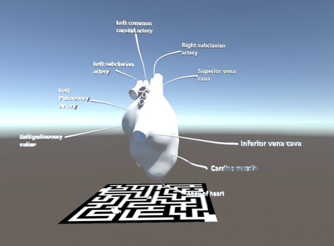

# HackathonFall2019

AR Teaching Tool
This application takes a QR code and displays a 3d render in AR. The object that the teacher is wanting to display; such as a heart in our case, will display on the users screen. This can be expanded to many more things such as a solar system, or a famous sculpture for an art class. 
 
 
This could further be expanded by creating a deck of cards that have individual learning lessons with fun facts on the back and the QR code on the front. These decks can then be distributed among tables for students to learn about history, science, languages, and many more applications. 

### Installation

First you need to the lastest version of unity and import the Vuforia package.
Then go to Edit > Project settings>players>XR settings and enable Vuforia

### Contributors 
Daniel Bae

Osama Alhaiki

Sam Nugent

Michael Couey
